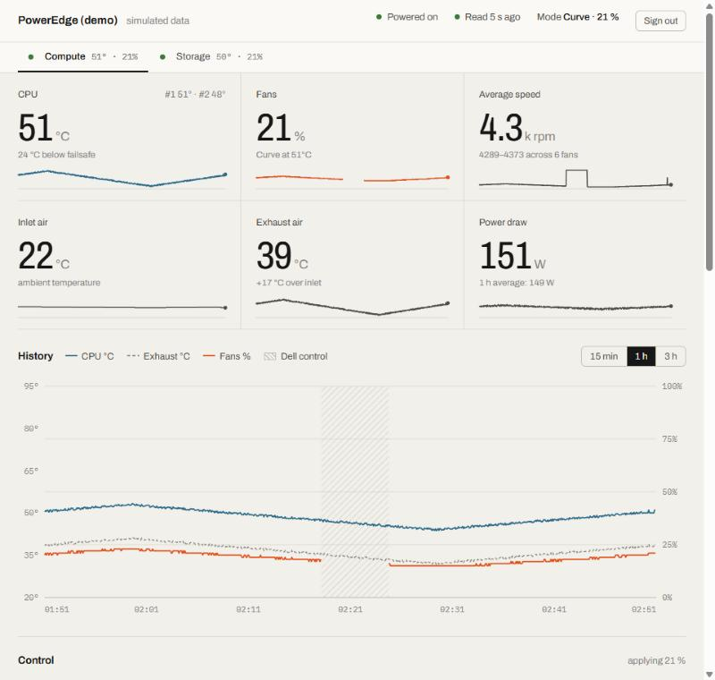

# iDRAC Fan Control

A small self-hosted web dashboard that takes over fan control on Dell PowerEdge servers through
the iDRAC, so a homelab server can run quietly without cooking itself.

<picture>
  <source media="(prefers-color-scheme: dark)" srcset="docs/dashboard-dark.jpg">
  
</picture>

## Features

- **Three modes**: Dell automatic, a fixed speed, or a temperature → speed **curve** you drag into shape.
- **Failsafe**: at or above a CPU temperature you choose, control goes back to the iDRAC.
- **Fails safe by default**: missing CPU readings, a powered-off server, a refused command, a crash
  in the controller loop, or `docker stop` all hand the fans back to Dell automatic mode.
- Live readings: hottest CPU, inlet and exhaust air, every fan's RPM, power draw.
- Three hours of history with hover read-outs, with the periods the iDRAC was in control marked.
- Toggle Dell's default cooling response for third-party PCIe cards.
- Sign-in page with a single password, event log, light and dark themes, works on a phone.
- One Python file, standard library only. The image is `python:alpine` plus `ipmitool`.

## Integrations

| Variable | What it enables |
| --- | --- |
| `IDRAC_1_HOST`, `IDRAC_1_USERNAME`, `IDRAC_1_PASSWORD`, `IDRAC_1_NAME` (and `_2_`, `_3_`...) | Several servers in one dashboard |
| `DISCORD_WEBHOOK_URL` | Alerts on failsafe, unreachable iDRAC, refused commands and recovery |
| `METRICS_TOKEN` | Prometheus metrics at `/metrics` with `Authorization: Bearer <token>`. Grafana dashboard: `docs/grafana/idrac-fan-control.json` |
| `EMBED_TOKEN` | Read-only widget at `/embed?server=<id>&token=<token>&theme=dark` |

**Homarr:** add an *iFrame* widget with the `/embed` URL above, and an app tile pointing at the dashboard
with its status check on `/healthz`.


**Upgrading from 1.0:** the container now runs as uid 1000. Run `chown -R 1000:1000` on the data folder.
For `IDRAC_HOST=local`, add `user: "0:0"` so the container can open `/dev/ipmi0`.

## Compatibility

The dashboard uses Dell's OEM IPMI raw commands for fan control. Whether a server accepts them
depends on its iDRAC firmware, not on the model:

| iDRAC | Manual fan control |
| --- | --- |
| iDRAC 6, 7 and 8 (11th to 13th generation) | Supported |
| iDRAC 9 up to firmware 3.30.30.30 | Supported |
| iDRAC 9 from firmware 3.34.34.34, iDRAC 10 | Removed by Dell |

Some 11th-generation servers reject the "all fans" selector and need per-fan commands, which are
not implemented. On those, and on firmware without the commands, the dashboard says so in the
event log and leaves the fans in Dell automatic mode.

### iDRAC setup

1. The iDRAC user must be an **Administrator**.
2. For network access, enable **IPMI over LAN** in the iDRAC web interface
   (iDRAC Settings → Network → IPMI Settings).
3. Check it from any Linux machine:

   ```bash
   ipmitool -I lanplus -H <idrac-ip> -U <user> -P <password> sdr type temperature
   ```

## Quick start

```bash
curl -O https://raw.githubusercontent.com/ST-DEVPT/idrac-fan-control/main/docker-compose.yml
```

Edit the iDRAC address, credentials and `WEB_PASSWORD` in `docker-compose.yml`, then:

```bash
docker compose up -d
```

Open `http://<docker-host>:8080` and sign in with `WEB_PASSWORD`.

Images are published for `linux/amd64` and `linux/arm64` at
`ghcr.io/st-devpt/idrac-fan-control`.

### Configuration

| Variable | Default | Description |
| --- | --- | --- |
| `IDRAC_HOST` | `local` | iDRAC IP or hostname; `local` when the container runs on the server itself (pass `/dev/ipmi0` through); `demo` for simulated data |
| `IDRAC_USERNAME` | `root` | iDRAC user |
| `IDRAC_PASSWORD` | `calvin` | iDRAC password. Passed to `ipmitool` through its environment, never on the command line |
| `WEB_PASSWORD` | empty | Dashboard password. Empty disables sign-in; only do that on a trusted network |
| `CHECK_INTERVAL` | `15` | Seconds between readings and fan commands (minimum 5) |
| `PORT` | `8080` | HTTP port inside the container |

Mode, fixed speed, curve, failsafe temperature and the PCIe setting are changed in the dashboard and
stored in `/data/settings.json`.

### Security

- The dashboard controls hardware. Do not expose it to the internet.
- Sessions are signed cookies (`HttpOnly`, `SameSite=Strict`). Changing `WEB_PASSWORD` or deleting
  `/data/secret` signs everyone out.
- Failed sign-ins are slowed to about one attempt per second.
- Plain HTTP sends the password in clear text. Behind a reverse proxy with TLS, the cookie is also
  marked `Secure` when the proxy sends `X-Forwarded-Proto: https`.

Example with the proxy on the same host, keeping the port off the LAN:

```yaml
    ports:
      - "127.0.0.1:8080:8080"
```

## How it works

Every `CHECK_INTERVAL` seconds the controller reads `ipmitool sdr elist full` and
`chassis power status`, takes the hottest CPU and decides:

1. Dell mode, no CPU reading, server off, or CPU at or above the failsafe:
   `raw 0x30 0x30 0x01 0x01` (Dell automatic).
2. Otherwise: `raw 0x30 0x30 0x01 0x00` (manual) and `raw 0x30 0x30 0x02 0xff <speed>`.

The manual command is sent again on every cycle, because an iDRAC reset silently returns to
Dell mode. If setting the speed fails after manual mode was enabled, Dell mode is restored at once.

## Development

```bash
IDRAC_HOST=demo python app.py   # dashboard on http://localhost:8080 with simulated data
python test_app.py              # self-check
```

Python 3.10 or newer, no dependencies.

## License

[MIT](LICENSE)
