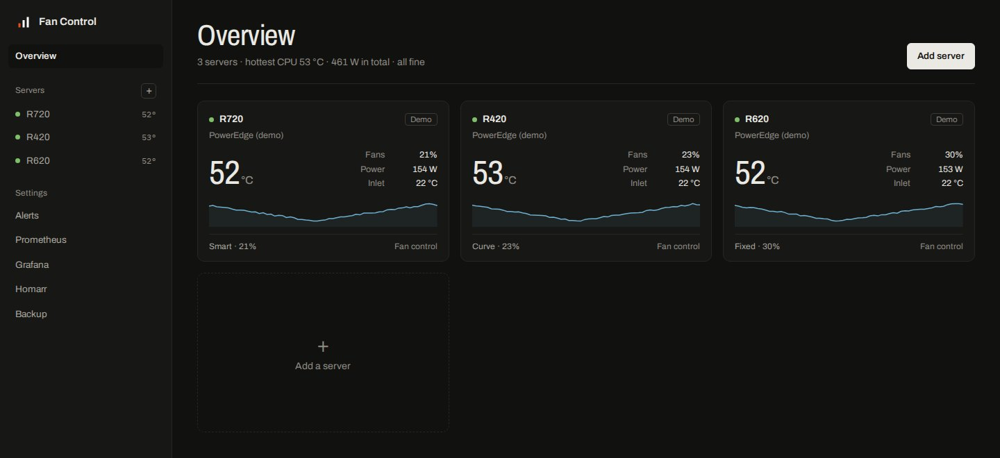
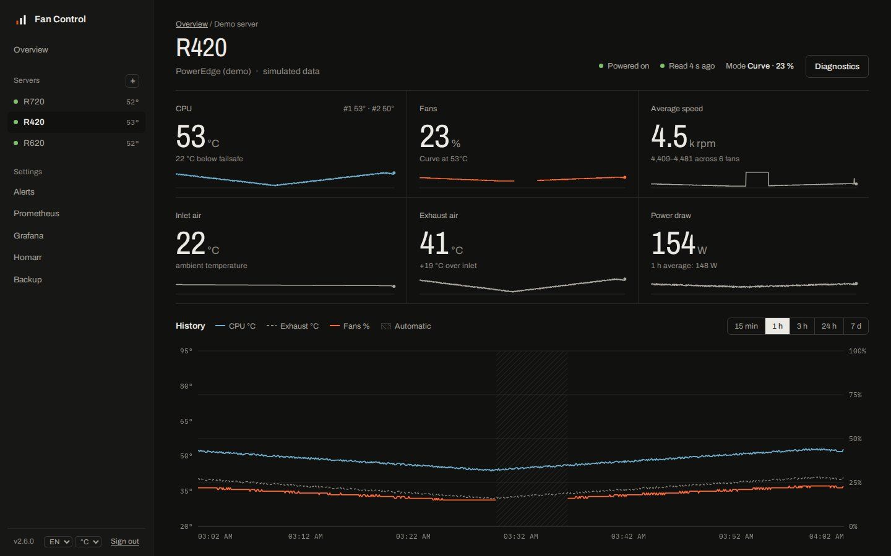
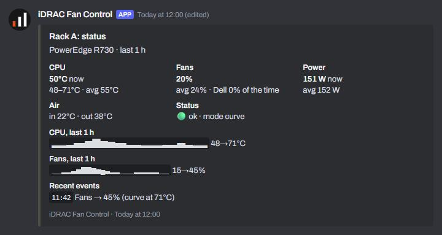
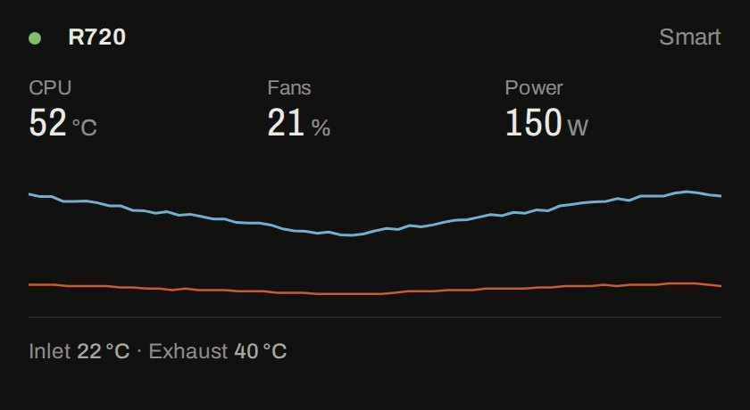

# Fan Control

**Quiet rack servers, without cooking them.** A self-hosted dashboard for Dell PowerEdge, Supermicro,
HPE ProLiant and any Redfish or IPMI server. It takes over fan control where the vendor allows it, holds
the temperatures you choose, hands control back to the BMC the moment anything looks wrong, and watches
everything else.

[](https://github.com/ST-DEVPT/rack-fan-control/actions/workflows/docker.yml)
[](https://github.com/ST-DEVPT/rack-fan-control/releases)
[](https://github.com/ST-DEVPT/rack-fan-control/pkgs/container/rack-fan-control)
[](LICENSE)





## Highlights

- **Every server in one place**: an overview of the rack and a page per server. Scan your network for BMCs,
  let each one tell its vendor and firmware, test the connection, add it.
- **Smart mode**: holds the CPU at a target with as little fan as it can. It learns the speed each load
  needs on your server, sees heat coming before it arrives and rides out short bursts. Or draw a curve, or
  pick a fixed speed.
- **Safe by design**: the BMC takes over on a CPU failsafe, on hot exhaust air, when any sensor nears the
  warning level its BMC defines, on missing readings, refused commands, crashes and `docker stop`.
  A minimum speed and a dry-run mode for trying things out.
- **Quiet hours**, ramp-down smoothing, curve presets, and 3 h / 24 h / 7 d history that survives restarts.
- **Discord** alerts you can fully customise, and a status card that keeps itself up to date.
- **Prometheus**, a ready-made **Grafana** dashboard, and **Homarr** widgets (a native Homarr 2.0 widget and
  an iFrame for any dashboard) that show only what you choose, each with its own setup page.
- **Read-only accounts**, backups, English or Portuguese, °C or °F.
- **Small and private**: plain Python, no dependencies, no third-party requests, runs as non-root.

## Contents

[Supported hardware](#supported-hardware) ·
[Quick start](#quick-start) ·
[Configuration](#configuration) ·
[Fan control](#fan-control) ·
[Alerts](#alerts) ·
[Integrations](#integrations) ·
[Accounts and security](#accounts-and-security) ·
[Backup](#backup) ·
[Troubleshooting](#troubleshooting) ·
[Upgrading](#upgrading) ·
[Development](#development)

## Supported hardware

| Type | Servers | Fan control | Reads |
| --- | --- | --- | --- |
| **Dell PowerEdge (iDRAC)** | iDRAC 6, 7, 8, and iDRAC 9 up to firmware 3.30.30.30 | Yes | IPMI |
| **Supermicro** | X9, X10 and X11 boards | Yes, experimental | IPMI |
| **HPE iLO 4, unlocked firmware** | ProLiant Gen8 / Gen9 with the community-patched iLO 4 2.77 | Yes (caps over SSH), experimental | Redfish |
| **Redfish** | HPE iLO 4 (2.30+), iLO 5, iLO 6, Lenovo XCC, Dell iDRAC 9, most recent BMCs | Monitoring only | Redfish |
| **Other IPMI** | Any BMC with IPMI over LAN | Monitoring only | IPMI |
| **Demo** | Simulated readings | Yes (simulated) | — |

Monitoring only means the vendor firmware offers no way to set fan speed. Those servers still get the
overview card, history, alerts, reports, metrics and the widget, which is often enough to find what makes
a server loud: on HPE, a third-party PCIe card or disk the iLO cannot read is the usual cause.

Dell iDRAC 9 from firmware 3.34.34.34, and iDRAC 10, no longer accept fan commands: add them as Redfish.
Not sure what you have? **Scan network** and **Detect** on the *Add server* page ask the BMCs and pick the
type for you. The scan only accepts private ranges, up to a /22, and only an admin can run it.

## Quick start

**1. Run the container**

```bash
mkdir fan-control && cd fan-control
curl -O https://raw.githubusercontent.com/ST-DEVPT/rack-fan-control/main/docker-compose.yml
mkdir data && chown 1000:1000 data
```

Set `WEB_PASSWORD` (and `TZ`) in `docker-compose.yml`, then:

```bash
docker compose up -d
```

**2. Open `http://<docker-host>:8080`**, sign in, and choose **Add server**.

**3. Find your servers**: **Scan network** probes a private range (for example `192.168.1.0/24`) for BMCs
answering Redfish or IPMI and suggests the type of each; **Use** fills in the form. Or enter one address and
press **Detect**, or pick the hardware yourself. Fill in the user and
password and press **Test connection**: it reads the BMC once and shows the model, sensors and power draw
before anything is saved.

Before adding a server, prepare its BMC:

- **Dell**: enable **IPMI over LAN** (iDRAC Settings → Network → IPMI Settings); the user must be an Administrator.
- **Supermicro**: IPMI over LAN is on by default; use an Administrator account.
- **HPE and other Redfish**: any account that can read the system health. Redfish uses HTTPS (port 443).
- **HPE iLO 4 unlocked**: SSH (port 22) and HTTPS must both be reachable, and the firmware must be the patched 2.77.

Images are built for `linux/amd64` and `linux/arm64`. Use the major version tag,
`ghcr.io/st-devpt/rack-fan-control:2`: it takes every fix and feature of 2.x and never a change that breaks
your settings. `:latest` follows the main branch, `:2.2` or `:2.2.0` pin a release.

## Configuration

Servers, fan settings and Discord are configured in the dashboard. The environment holds the rest:

| Variable | Default | Description |
| --- | --- | --- |
| `WEB_PASSWORD` | empty | Admin password. Empty disables sign-in; only do that on a trusted network |
| `VIEW_PASSWORD` | empty | Optional read-only account: sees everything, changes nothing |
| `TZ` | UTC | Time zone for quiet hours and the event log, e.g. `Europe/Lisbon` |
| `CHECK_INTERVAL` | `15` | Seconds between readings and fan commands. Minimum 5 |
| `DISCORD_WEBHOOK_URL` | empty | Default Discord webhook. A webhook pasted in the dashboard takes precedence |
| `METRICS_TOKEN` | empty | A metrics token for `/metrics` (`Authorization: Bearer <token>`). Tokens can also be created on the Prometheus page |
| `EMBED_TOKEN` | empty | A widget token for `/embed?token=` and `/api/widget`. Tokens can also be created on the Homarr page |
| `TRUST_PROXY` | off | Set to `true` behind a reverse proxy, so sign-in limits and the event log use `X-Forwarded-For` |
| `PORT` | `8080` | HTTP port inside the container |

### Servers in the environment

Servers can also be declared in `docker-compose.yml`, for example to keep credentials in a `.env` file.
They show up in the dashboard like the others, but can only be changed in the environment:

```yaml
    environment:
      SERVER_1_NAME: Compute
      SERVER_1_DRIVER: dell              # dell, supermicro, ilo4-unlocked, redfish, ipmi or demo
      SERVER_1_HOST: 192.168.1.120       # "local" for IPMI from the server itself
      SERVER_1_USERNAME: root
      SERVER_1_PASSWORD: ${COMPUTE_BMC_PASSWORD}
      SERVER_2_NAME: DL360
      SERVER_2_DRIVER: redfish
      SERVER_2_HOST: 192.168.1.121
      SERVER_2_USERNAME: Administrator
      SERVER_2_PASSWORD: ${DL360_ILO_PASSWORD}
      SERVER_2_VERIFY_TLS: "false"       # BMCs ship self-signed certificates
```

The 1.x variables still work and keep their settings: `IDRAC_HOST`, `IDRAC_USERNAME`, `IDRAC_PASSWORD`,
`IDRAC_NAME` for one server and `IDRAC_1_HOST`, ... for several.

### What is stored in `/data`

| File | Contents |
| --- | --- |
| `servers.json` | Servers added in the dashboard, with their BMC passwords (file mode 600, never sent to the browser) |
| `settings.json`, `settings-<server>.json` | Mode, curve, targets, limits, quiet hours and the other fan settings |
| `history-<server>.json` | Three hours of readings, seven days of 5-minute averages, and the events |
| `alerts.json` | Alert settings, including the Discord webhook and the ntfy, Gotify and webhook addresses and tokens (file mode 600, never sent to the browser) |
| `smart-<server>.json` | What smart mode learned: the fan speed each heat load needs |
| `widget.json` | Which fields widgets may show |
| `tokens.json` | Widget and metrics tokens, as SHA-256 hashes (file mode 600) |
| `report-state.json` | Which Discord message the status card is edited into |
| `known_hosts` | SSH host keys of unlocked iLO 4 servers, recorded on first connection |
| `secret` | Key that signs sign-in sessions. Delete it to sign everyone out |

## Fan control

For servers whose type has fan control (Dell, Supermicro, unlocked iLO 4):

| Mode | What happens |
| --- | --- |
| **Automatic** | The BMC runs its factory profile. Loudest, and the fallback for every problem |
| **Fixed** | Every fan at one speed |
| **Curve** | Speed follows the hottest CPU along points you drag. Start from a preset (quiet, balanced, cool, storage) or copy another server's curve |
| **Smart** | Holds the CPU at a target you set with as little fan as it can, learning what each load needs, and keeps every other sensor clear of its limits |

### Smart mode

Smart mode watches the CPU against its target, the exhaust air against 8 °C below its limit, and every
sensor with a BMC warning threshold against 8 °C below the point where the failsafe would trip. Inlet air
is left out: no fan speed cools the room. It answers to whichever is worst, in four ways:

- **It learns your server.** Whenever a load has been held steady at the target for a minute, it remembers
  the fan speed that did it, against the heat load: power draw over the room left between the inlet air
  and the target. When that load comes back, the fans go straight to what worked last time instead of
  waiting for the heat. A warm day or a new target needs no relearning, because the heat load already
  accounts for both. The server page draws what it has learned; **Forget** starts it afresh. It learns
  nothing during a dry run.
- **It looks ahead.** Each temperature is judged where its trend over the last minute puts it 40 seconds
  later, so a CPU that is climbing gets air before it arrives.
- **It corrects itself.** A proportional and integral trim on top fixes what the learned map gets wrong,
  and the map slowly takes the correction over.
- **It stays quiet.** Fans rise at once, but fall only after lower demand has lasted the ramp-down delay,
  and then slowly, so a job that comes and goes every minute leaves them steady. Corrections under 2 %
  are ignored. At idle it rests on the minimum speed.

When something heads for its trip point, smart mode **boosts** the fans by 25 % at once, so the BMC rarely
has to take over. During quiet hours the cap gives way gradually from 8 °C below a trip point: louder fans
beat a failsafe.

### Protection

The BMC takes over, whatever the mode, when:

- the hottest CPU reaches the **CPU failsafe**;
- the exhaust air reaches the **exhaust air limit** (on by default, empty turns it off);
- any sensor comes within the margin (5 °C by default) of the **warning threshold its BMC defines**:
  PCIe cards, disks, DIMMs, the RAID controller, which a CPU-only curve would never see;
- there is no CPU reading, the server is off, a fan command is refused, the control loop fails, the
  server is removed or the container stops.

Manual control resumes once things are 3 °C below the limit that tripped, so the fans don't flap at the
edge. Fans never run below the **minimum speed** in manual modes.

**If the controller itself stops.** A control loop that stops turning for 3 minutes trips a watchdog:
every fan goes back to its BMC and the process exits, so Docker's restart policy (`restart:
unless-stopped`) starts a fresh one. The image's health check reads `/livez`, which follows the control
loops and not the BMCs. What no process can cover is its own sudden death (`kill -9`, out of memory,
Docker gone): a Dell iDRAC then keeps the last manual speed. For that, run
[`scripts/fan-guard.sh`](scripts/fan-guard.sh) from the host's cron every minute. When the container is
not running healthy for two minutes in a row, it hands the fans back to the iDRAC with `ipmitool`:

```bash
* * * * * /root/docker/fan-guard.sh >> /var/log/fan-guard.log 2>&1
```

**Dry run** decides and logs what it would send ("Dry run: would set fans to 25%"), but leaves the fans
to the BMC. Use it to try a new server type or a new curve.

### Smoothing and quiet hours

**Ramp-down delay**: fans speed up at once but slow down only after the lower speed has been asked for
during the whole delay. It never runs the fans slower than the curve. Smart mode uses it the same way.

**Quiet hours** cap the speed between two times of day, for example 23:00 to 07:00 at 25 %. Protection
still applies at any hour.

### A starting point

For a quiet homelab server with Xeon E5 processors, the **Quiet** preset (35 °C → 12 %, 45 → 15, 55 → 22,
62 → 35, 68 → 55) with a 72 °C failsafe, or **Smart** with a 60 °C target. Some BMCs raise fan alarms below
about 10 %. With third-party PCIe cards installed, stay at 15 % or above, and on Dell leave the
third-party PCIe cooling response **On**.

**Per vendor.** Dell gets one IPMI command for all fans; some 11th-generation servers refuse it, and the
controller then finds the fans they accept and sets them one by one. Supermicro is switched to *Full* fan
mode once, then both zones are set; it goes back to *Optimal* when released. An unlocked iLO 4 gets a cap on
every fan over SSH (`fan p N max`), so its own curve still runs underneath; releasing removes the cap.

## Alerts

Open **Alerts** in the sidebar and paste a Discord webhook (Server Settings → Integrations → Webhooks → Copy
Webhook URL). Everything else is optional: bot name, avatar, footer, a colour per level, mentions (nobody,
`@here`, `@everyone`, a role or a user, only for the levels you choose), a cooldown, and which events to send,
each with its own title and message. A live preview shows the result and **Send test** posts it before you
save. Text that comes from a BMC can never ping anyone.

| Event | Level | Sent when |
| --- | --- | --- |
| Failsafe reached | warning | A limit trips and the BMC takes over |
| Failsafe cleared | resolved | Manual control resumes |
| Running hot | warning | The CPU passes the "running hot" temperature (off by default) |
| BMC unreachable | error | Readings fail |
| Fan command refused | error | The BMC rejects a fan command |
| Back to normal | resolved | The BMC answers and accepts commands again |
| Controller error | error | The control loop hits an unexpected error |
| Failsafe lasting | error | The BMC has held the fans for longer than the set time (10 min by default) |
| Fan failed | error | A fan stops while the others spin, or the BMC reports it failed (two readings in a row) |
| Fan commands ignored | error | The speed moved by 20 points or more, and 30 s later the RPM had not followed |
| Room running hot | warning | The inlet air passes its warning temperature (35 °C by default) |
| Settings changed | info | Someone applies new settings (off by default) |
| Controller started | info | The container starts (off by default) |
| Status report | info | On a schedule (off by default) |

Placeholders: `{server}` `{host}` `{model}` `{cpu}` `{speed}` `{mode}` `{reason}` `{error}` `{failsafe}`
`{threshold}` `{interval}` `{time}`; status reports add `{period}` `{cpu_min}` `{cpu_avg}` `{cpu_max}`
`{speed_avg}` `{power_avg}` `{dell_pct}`.

The **status report** is one card per server: CPU, fans and power now, minimum, average and maximum over
the period, air temperatures, time under automatic control, trend lines and the latest events. By default
the same message is edited each time, so the channel holds one live status card.



**ntfy, Gotify and any webhook.** Under *Other channels*, the same events and texts go out as plain text:
to an ntfy topic (`https://ntfy.sh/my-topic`, with an access token if the topic is protected), to a Gotify
application, or as JSON to any URL (event, level, title, message, server, time and values), which Home
Assistant, n8n and most automation tools take as is. Each has its own **Send test**. The status card stays
on Discord only.

## Integrations

Each has its own page in the sidebar, with the snippets filled in for your setup.

**Prometheus**: create a metrics token on the Prometheus page (or set `METRICS_TOKEN`); the page shows the
scrape job to paste and the live `/metrics` output.

```yaml
scrape_configs:
  - job_name: fan-control
    authorization:
      credentials: <metrics token>
    static_configs:
      - targets: ["<docker-host>:8080"]
```

| Metric | Labels |
| --- | --- |
| `fanctl_up`, `fanctl_power_on`, `fanctl_bmc_control`, `fanctl_failsafe_active` | `server`, `name`, `driver` |
| `fanctl_cpu_temperature_celsius`, `fanctl_inlet_temperature_celsius`, `fanctl_exhaust_temperature_celsius` | `server`, `name`, `driver` |
| `fanctl_fan_speed_percent`, `fanctl_power_watts`, `fanctl_last_update_timestamp_seconds` | `server`, `name`, `driver` |
| `fanctl_temperature_celsius` | ... `sensor`, `entity` |
| `fanctl_fan_rpm`, `fanctl_fan_percent` | ... `fan` |

**Grafana**: download the dashboard from the Grafana page (or `web/grafana.json`), then
Dashboards → New → Import, and pick your Prometheus data source.

**Homarr**: on the Homarr page, create a widget token (one per dashboard, so each can be revoked), then:

1. **Choose what widgets may show**: status, CPU, fans, power, inlet and exhaust air, the last-hour chart,
   the server model. The token reads those fields and nothing else: never the BMC address, settings,
   events or error messages.
2. **Homarr 2.0**: download the native widget, import it under *Management → Custom Widgets*, and give it
   the widget token as its Bearer credential. Homarr fetches `/api/widget` itself; the widget has options for
   the server (or all of them), °C or °F, the chart and the air temperatures.
3. **Any dashboard**: the page builds an *iFrame* address for one server or the whole rack, a theme, a
   background and the fields to show, with a live preview. Any frame size works: a short one drops the
   chart first, then the footer.
4. **App tile**: `/healthz` answers `200` while every BMC answers and `503` as soon as one stops.



## Something wrong with your hardware?

On a server's page, **Diagnostics** downloads what its BMC answers, raw (`ipmitool sdr`, `sensor`, `mc info`,
or the Redfish chassis, thermal, power and system documents), with what Fan Control made of it, the
settings and the recent events. Passwords, the BMC address, serial numbers and network details are left
out. Attach it to an issue: it is what's needed to support a BMC nobody has tested yet.

## Accounts and security

- `WEB_PASSWORD` is the admin account. `VIEW_PASSWORD` adds a read-only one: everything is visible,
  nothing can be changed, and the backup can't be downloaded.
- Changes are written to the server's event log with the account and address that made them.
- Failed sign-ins are slowed and limited to 5 per address in 10 minutes; one address guessing does not lock
  out the others. Behind a proxy, set `TRUST_PROXY=true` so the real address is used.
- Keep the dashboard on your LAN or VPN. With a reverse proxy on the same host, publish the port on
  localhost only (`"127.0.0.1:8080:8080"`), forward to it, and keep the `Host` header (the default in
  Nginx Proxy Manager). The session cookie gets the `Secure` flag when the proxy sends `X-Forwarded-Proto: https`.

Details, and how to report a vulnerability, are in [SECURITY.md](SECURITY.md).

## Backup

The **Backup** page downloads the servers added in the dashboard, every server's fan settings and the
Discord configuration as one JSON file, and imports such a file on this or another machine. Passwords and
the webhook are included only when you tick the box; a backup without them restores the settings, but
servers have to be added again with their passwords.

## Troubleshooting

Use **Test connection** (Edit on the server's page) to see the BMC's answer without saving anything, and
**Dry run** to watch what the controller would do.

| Message | Meaning |
| --- | --- |
| `rsp=0xc1` | The firmware does not have the fan commands (Dell iDRAC 9 3.34.34.34 or later): use the Redfish type |
| `rsp=0xd4` | The BMC user is not an Administrator |
| `Unable to establish IPMI v2 / RMCP+ session` | Wrong address or credentials, or IPMI over LAN is off |
| `Redfish ...: HTTP 401` | Wrong user name or password |
| `Redfish ...: timed out` | The BMC is not reachable on HTTPS from the container |
| `SSH: ... (is the iLO firmware unlocked?)` | The iLO answered, but does not have the `fan` command: stock firmware |
| `... near its N°C warning threshold` | A sensor other than the CPU is hot; see the Temperatures table, where each bar marks its threshold |
| `ERROR: cannot write to /data` (container log) | The data folder is not owned by uid 1000 |

## Upgrading

```bash
docker compose pull && docker compose up -d
```

**From 1.x:** the image is now `ghcr.io/st-devpt/rack-fan-control`; change it in your compose file.
`IDRAC_*` variables keep working, with their settings and history. Metrics are renamed from `idrac_*` to
`fanctl_*`: re-import the Grafana dashboard. The mode called "Dell" is now "Automatic"; saved settings are
converted. Sessions from 1.x are signed out once.

**From 1.0:** the container runs as uid 1000. Give it the data folder once with `chown -R 1000:1000 ./data`.
With `IDRAC_HOST=local`, the container needs `/dev/ipmi0` and root to open it:

```yaml
    user: "0:0"
    devices:
      - /dev/ipmi0:/dev/ipmi0
```

Changes are listed in [CHANGELOG.md](CHANGELOG.md).

## Development

```bash
python app.py                   # dashboard on http://localhost:8080; add a "Demo server" to try it
python -m unittest              # tests: drivers, control logic, smart mode, server registry, alerts, HTTP
```

Python 3.10 or newer, no dependencies. The code is in `fanctl/`: `drivers.py` (how each kind of BMC is read
and driven), `control.py` (decisions and smart mode, no I/O), `server.py` (control loop and server registry),
`alerts.py` (Discord, ntfy, Gotify, webhooks), `metrics.py` (Prometheus), `widgets.py` (what widgets may read,
the Homarr widget), `tokens.py` (dashboard tokens), `backup.py` and `web.py` (HTTP and sessions); `app.py`
starts it all, with the watchdog. Adding a vendor means a class in `drivers.py` with `read()`, `diagnose()`
and, if it can control fans, `set_speed()` and `set_auto()`. The web pages are in `web/`: `app.js` (router,
server page, controls), `editor.js` (adding servers), `alerts.js`, `integrations.js` (Prometheus, Grafana,
Homarr, backup) and `i18n.js` (the Portuguese translation), served with a strict Content-Security-Policy.

## License

[MIT](LICENSE). Bundled fonts: Archivo and IBM Plex Mono, under the SIL Open Font License (`web/fonts/`).
